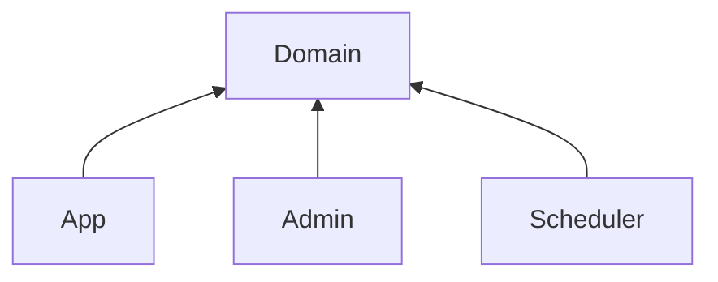
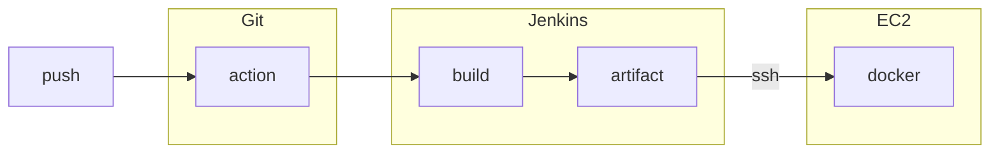

# Webtoon API

## Preview

## Link

## Project board

이슈 관리 도구로는 [Trello](https://trello.com/b/X4rTGNYR/webtoon) 를 사용하고 있습니다.

## Modules

다른 기능을 가지는 애플리케이션(App, Admin, Scheduler)을 분리하고, 도메인 부분을 각 애플리케이션에서 재사용하기 위해 멀티모듈을 구성합니다.

## Properties

환경은 프로파일로 구분합니다.

- `application.yml`
- `application-ci.yml`
- `application-prod.yml`

설정 파일은 Vault 로 관리하며, 애플리케이션은 배포 시에 프로젝트 루트의 `config/` 에 설정파일을 불러와 사용합니다.

## CI / CD

CI 도구로는 젠킨스를 사용합니다. 요약한 플로우는 아래와 같습니다.

