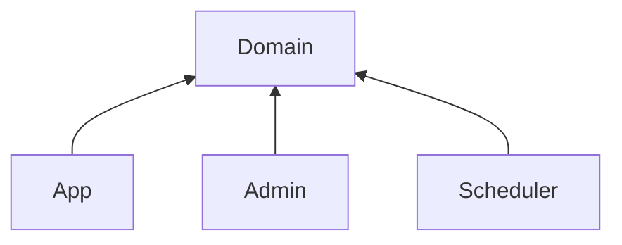

# Webtoon API

## Preview

## Link

## Modules



다른 기능을 가지는 애플리케이션(App, Admin, Scheduler)을 분리하고, 도메인 부분을 각 애플리케이션에서 재사용하기 위해 멀티모듈을 구성합니다.

## Properties

환경은 프로파일로 구분합니다.

- `local`
- `prod`
- `test`

```yaml
spring:
  config:
    activate:
      on-profile: local

---

spring:
  config:
    activate:
      on-profile: prod
```

애플리케이션은 각 모듈 `resources` 디렉터리의 `application.yml` 파일을 사용합니다.
