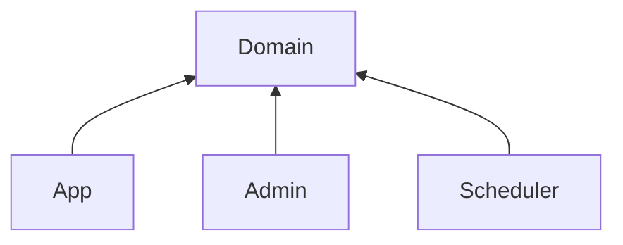

# Webtoon API

## Preview

## Link

## Modules



다른 기능을 가지는 애플리케이션(App, Admin, Scheduler)을 분리하고, 도메인 부분을 각 애플리케이션에서 재사용하기 위해 멀티모듈을 구성합니다.

## Properties

환경은 프로파일로 구분합니다.

```yaml
spring:
  config:
    activate:
      on-profile: app-local

---

spring:
  config:
    activate:
      on-profile: app-test

---

spring:
  config:
    activate:
      on-profile: app-prod

---

spring:
  config:
    activate:
      on-profile: admin-local

  ...
```

애플리케이션은 프로젝트 루트의 `config/` 에 정의된 설정파일을 사용합니다.
